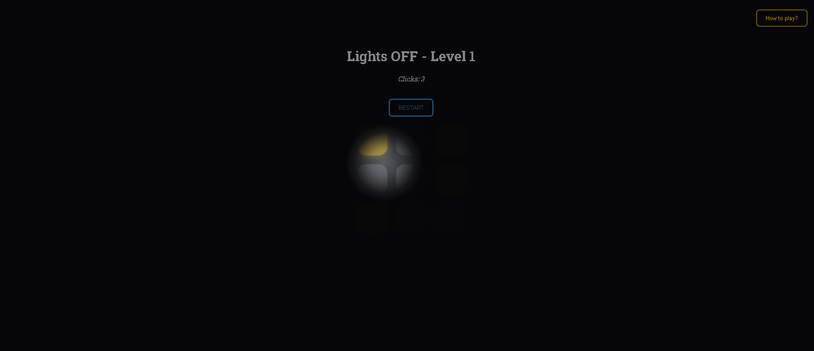
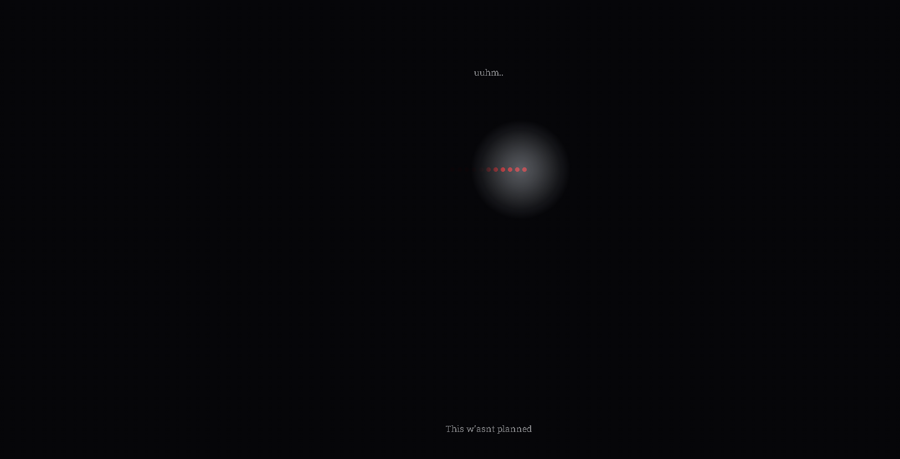
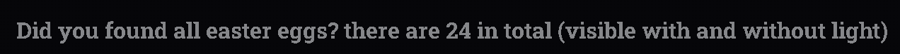

[](https://github.com/noamopilo/lights-OFF) [](https://noamopilo.github.io/Lights-OFF/)

# **Lights OFF**

Lights out (but with a twist),
and surprises.

---

## Table of content

- [**Lights OFF**](#lights-off)
  - [Table of content](#table-of-content)
  - [How to play?](#how-to-play)
  - [Screenshots](#screenshots)
  - [File structure](#file-structure)
  - [Made for](#made-for)
  - [Made with](#made-with)
  - [Support](#support)
  - [License](#license)
  - [Status](#status)

---

## How to play?

The goal of the game is to try and turn all the lights in the grid off, with the least possible clicks.
Like the lights out game.
When you click on a light it switches itself and all lights arround it to the oposite state.

But you cannot see the whole grid at once because you're in the dark.
So you need to look with your flashlight.

When you finish a level you go to the next one.

There are 3 levels, each one is more difficult because it has a bigger grid.

Also you can look for the surprises hidden on the page.
In total there are 24.

_Can you find them all?_

[PLAY IT](https://nonobal-lights-off.vercel.app/)

---

## Screenshots








---

## File structure

This is the file structure of the game:

```text
└── 📁lights_OFF
    ├── index.html
    ├── LICENSE
    ├── main.js
    ├── README.md
    └── style.css
```

---

## Made for

I made this project for operation BLACKOUT of the PIXL evenement.
A YSWS hosted by Hack Club.

---

## Made with

  

---

## Support

For support you can make an **Issue** on the GitHub repo, thanks for helping with my project.

---

## License

[MIT](LICENSE)

---

## Status

finished: but I can still add some updates

---
